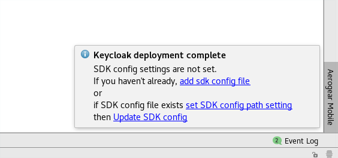
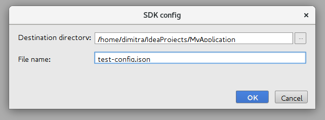
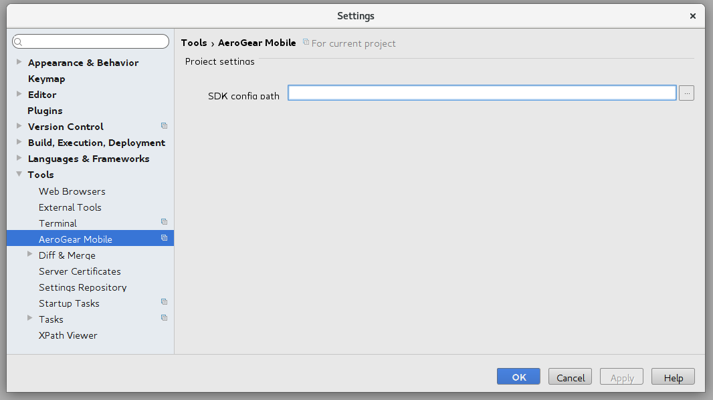

# Retrieving and saving mobile configuration

The SDK config file is used to allow communication between the client representation and the mobile services.

The Aerogear Mobile Android Studio Plugin allows you to do the following things:
- View current client configuration
- Generate a new configuration file
- Regenerate a configuration file (for example, if new mobile services are provisioned).

For the purpose of this document, we expect that you have [installed and enabled](https://github.com/aerogear/aerogear-mobile-intellij-plugin/blob/master/README.md) the plugin.


## Generating a new config file

Once you have created a client representation (`Tools -> Aerogear Mobile -> Create Client`) and successfully provisioned a new service (`Tools -> Aerogear Mobile -> Mobile Services`), you will see
a popup in the bottom right corner prompting you to generate a new SDK config file if one does not exist.



Select the directory you want the config file to be stored and an appropriate name for your file.
Once you click ok, a new SDK config file will be generated for you automatically in your desired directory.




If you want to use an already existing config file, click the 'set SDK config path setting' link in the popup. When prompted,
select the path of your config file and press 'apply'. Click the 'Update SDK config' link in the popup to save your changes.


## Updating the config

You can update the path to your config file at any time, by going to:

```File -> Settings -> Tools -> Aerogear Mobile```


You will then be presented with the same form as before. Update your path and press the 'apply' button.



## Viewing the config

To view your current config settings, go to:

```Tools -> Aerogear Mobile -> View Client Config```

